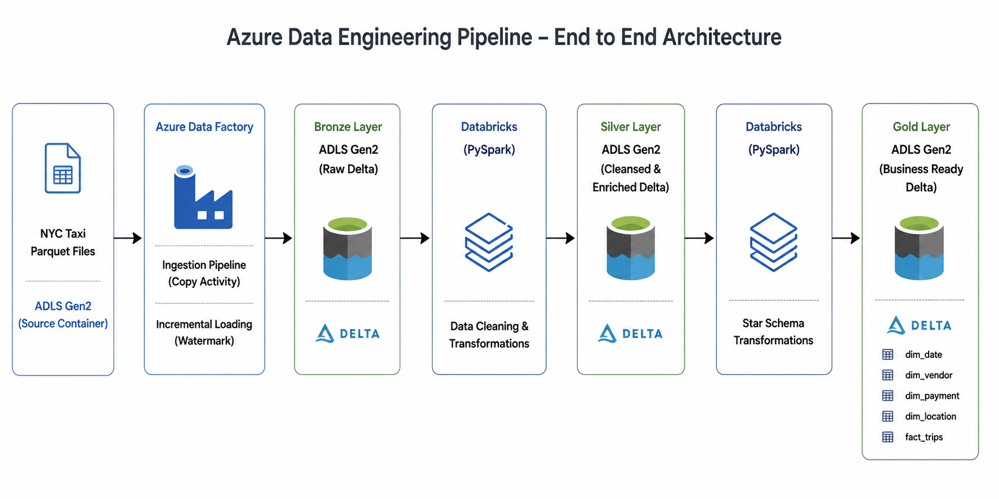

# End-to-End Azure Data Engineering Pipeline using Azure, Databricks & Delta Lake

<p align="center">
    
</p>

<p align="center">


</p>

---

# Overview

This project demonstrates the design and implementation of an end-to-end Azure Data Engineering pipeline using the Medallion Architecture (Bronze → Silver → Gold).

The pipeline ingests NYC Yellow Taxi trip data stored in Azure Data Lake Storage Gen2, orchestrates data movement with Azure Data Factory, performs distributed data transformations using Azure Databricks (PySpark), and stores curated business-ready data as Delta tables designed in a Star Schema for analytical reporting.

The solution follows modern cloud data engineering practices, including:

- Incremental data ingestion using watermark logic
- Medallion Architecture
- Delta Lake
- Data validation and cleansing
- Star Schema dimensional modeling
- Automated orchestration using Azure Data Factory

---

# Project Objectives

- Build an end-to-end Azure Data Engineering pipeline.
- Implement the Medallion Architecture.
- Perform incremental ingestion using watermark logic.
- Validate and cleanse raw datasets.
- Build a Star Schema data warehouse.
- Store curated data in Delta Lake.
- Automate the complete ETL workflow.

---

# Architecture

<p align="center">
    
</p>

```
NYC Yellow Taxi Dataset (Parquet)
                │
                ▼
Azure Data Lake Storage Gen2 (Source)
                │
                ▼
      Azure Data Factory
                │
                ▼
      Bronze Layer (Raw Delta)
                │
                ▼
 Azure Databricks (PySpark)
                │
                ▼
 Silver Layer (Validated Delta)
                │
                ▼
 Azure Databricks (PySpark)
                │
                ▼
 Gold Layer (Star Schema)
```

---

# Technology Stack

| Service | Purpose |
|----------|----------|
| Azure Data Factory | Pipeline Orchestration |
| Azure Data Lake Storage Gen2 | Cloud Storage |
| Azure Databricks | Distributed Data Processing |
| PySpark | Data Transformation |
| Delta Lake | Reliable Data Storage |
| Git & GitHub | Version Control |

---

# Dataset

**Primary Dataset**

- NYC Yellow Taxi Trip Records
- Format: Parquet

**Lookup Dataset**

- Taxi Zone Lookup Dataset

---

# Project Workflow

## 1. Source Layer

Monthly NYC Yellow Taxi datasets are stored as Parquet files inside Azure Data Lake Storage Gen2.

Azure Data Factory continuously detects newly added files and begins the ingestion process.

---

## 2. Bronze Layer

The Bronze layer stores raw source data without any business transformations.

Responsibilities:

- Incremental ingestion
- Preserve raw data
- Store Delta tables

Output

```
Bronze/
└── trips
```

---

## 3. Silver Layer

The Silver layer performs data cleansing, validation, and enrichment.

### Data Validation

- Duplicate removal
- Null handling
- Schema validation
- Data type validation

### Business Rule Validation

| Column | Validation |
|---------|------------|
| VendorID | Allowed values (1,2,6,7) |
| PaymentType | Allowed values (0–6) |
| RatecodeID | Allowed values (1–6,99) |
| StoreAndFwdFlag | Y / N |
| PassengerCount | Replace 0 with NULL |
| TripDistance | Must be greater than or equal to 0 |
| Pickup & Dropoff | Pickup time must be before Dropoff time |

### Derived Columns

- pickup_date
- pickup_year
- pickup_month
- pickup_day
- pickup_hour
- pickup_dayofweek
- pickup_weekofyear
- pickup_quarter
- dropoff_date
- dropoff_hour

The transformed data is stored in Delta format.

---

# Gold Layer

The Gold layer contains business-ready analytical tables organized using a Star Schema.

### Dimension Tables

- dim_date
- dim_vendor
- dim_payment
- dim_location

### Fact Table

- fact_trips

The Gold layer is rebuilt from the complete Silver layer using Delta Lake's overwrite operation, ensuring that the warehouse always contains the latest validated data.

---

# Star Schema

```text
                  dim_date
                      │
                      ▼
dim_vendor ───► fact_trips ◄─── dim_payment
                      ▲
                      │
                dim_location
      (Pickup & Dropoff Locations)
```

The **fact_trips** table references the following dimensions:

- **dim_date** – Calendar attributes for time-based analysis.
- **dim_vendor** – Taxi vendor information.
- **dim_payment** – Payment method details.
- **dim_location** – Pickup and dropoff location information.

The **dim_location** table is used as a **role-playing dimension**, where the same dimension table is referenced through both `pickup_location_key` and `dropoff_location_key`.

---

# Incremental Loading

The pipeline uses watermark-based incremental loading.

Pipeline activities include:

- Lookup
- Get Metadata
- ForEach
- If Condition
- Copy Activity
- Databricks Notebook
- Update Watermark

Only newly added source files are processed during each execution.

---

# Delta Lake

Delta Lake provides:

- ACID Transactions
- Schema Enforcement
- Schema Evolution
- Time Travel
- Reliable Writes
- Version Control

Each Delta table contains:

```
_delta_log/
part-00000...
part-00001...
```

The `_delta_log` directory maintains the complete transaction history of every table.

---

# Folder Structure

```
.
├── ADF
│   ├── dataset
│   ├── factory
│   ├── integrationRuntime
│   ├── linkedService
│   ├── pipeline
│   └── publish_config.json
│
├── Databricks
│   ├── Bronze_to_Silver.py
│   ├── Lookup_to_Silver.py
│   └── Silver_to_Gold.py
│
├── Architecture
│   └── architecture.png
│
├── Screenshots
│   ├── pipeline_success.png
│   ├── bronze_layer.png
│   ├── silver_layer.png
│   ├── gold_layer.png
│   └── databricks.png
│
└── README.md
```

---

# Pipeline Execution

1. Read Source Files
2. Detect New Files
3. Copy Data to Bronze
4. Transform Bronze to Silver
5. Validate Data
6. Generate Gold Layer
7. Build Star Schema

---

# Skills Demonstrated

- Azure Data Factory
- Azure Data Lake Storage Gen2
- Azure Databricks
- PySpark
- Delta Lake
- Incremental ETL
- Data Validation
- Data Cleansing
- Medallion Architecture
- Star Schema
- Data Warehousing
- Cloud Data Engineering
- Git
- GitHub

---

# Future Improvements

Potential enhancements include:

- CI/CD using Azure DevOps
- Infrastructure as Code using Terraform
- Delta Live Tables
- Azure Monitor integration
- Power BI Dashboard
- Automated Data Quality Framework

---

# Author

**Krishna K**

B.Tech in Artificial Intelligence and Data Science

Aspiring Azure Data Engineer

GitHub:
https://github.com/krishna-kotte

LinkedIn:
(Add your LinkedIn profile)

---

# License

This project is licensed under the MIT License.
